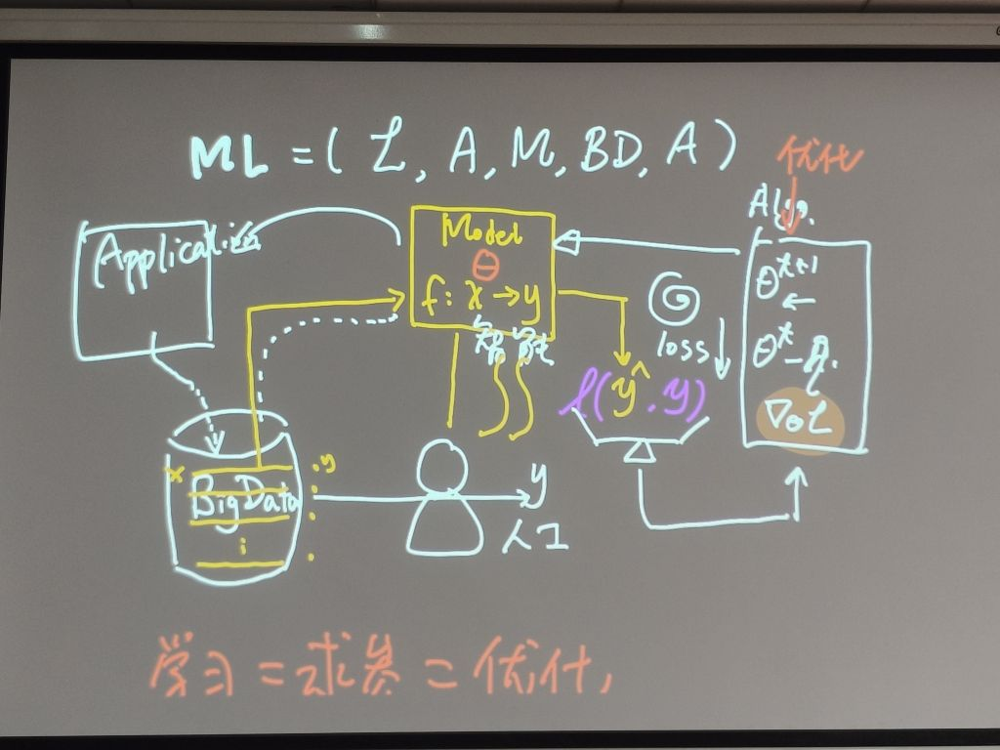

# 第一周 作业1

<!--

-->



λ=LAMBDA

(L = Loss， A = Algorithm， M = Model，BD = BigData，A = Application)

采用oop思想，根据λ写一个tiny–ML框架。

以上是本周机器学习课的作业1，截至时间9月8日晚，提交至邮箱994944128@qq.com。

以【添加附件】的形式发送，不要把内容写在邮件的正文部分。

作业按照＂学号-姓名-作业n＂格式命名。

如＂3722022345678–张三–作业1＂。

---

```python
"""
ML = Lambda = Loss + Algorithm + Model + BigData + Application
"""


class TinyML:
    def __init__(self, dist, alg, model, bigdata):
        self.dist = dist
        self.alg = alg
        self.model = model
        self.data = bigdata
        self.theta = None

    def loss(self, y, y_):
        return self.dist(y - y_)

    def algorithm(self, loss):
        self.theta = self.alg(loss, self.theta)

    def y_(self, X):
        f = self.model(self.theta)
        return f(X)

    def application(self, X, y):
        if y is not None:
            self.data.append(X, y)
        return self.y_(X)

```
