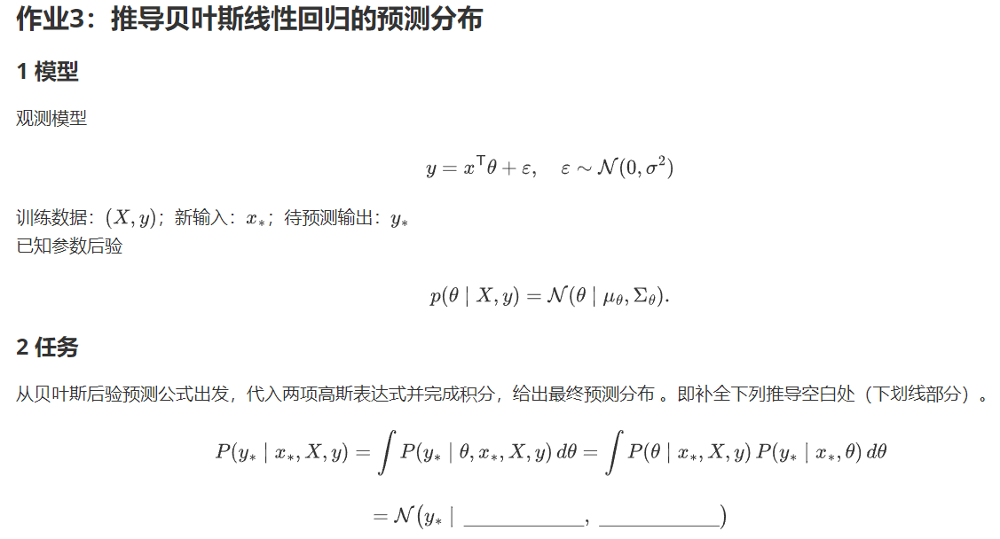

<!--
第三周

-->
# 第三周

注意！请大家在交作业的时候，记得按规范的格式提交！

<!--

-->

---

## Redefine the symbols
$$\begin{align}
\overrightarrow{x_*} & = ({x_*}_1, {x_*}_2, {x_*}_3, \cdots, {x_*}_d)^T \in \mathbb{R}^d \\
\overrightarrow{\theta} & = (\theta_1, \theta_2, \theta_3, \cdots, \theta_d)^T \in \mathbb{R}^d \\
y_* & = \overrightarrow{x_*}^T \overrightarrow{\theta} + \epsilon, \ \epsilon \sim \mathcal{N}{(0, {\sigma_\epsilon}^2)} \\
p(\theta; \mathbf{X}, \overrightarrow{y}) & = \mathcal{N}{(\overrightarrow{\mu_\theta}, \mathbf{\Sigma}_\theta)} \\
p(y_*; \overrightarrow{x_*}, \mathbf{X}, \overrightarrow{y}) & = \int_{\mathbb{R}^d}{p(y_*, \overrightarrow{\theta}; \overrightarrow{x_*}, \mathbf{X}, \overrightarrow{y}) \prod_{i = 1}^{d}{\mathrm{d}{\theta_i}}} \\
& = \int_{\mathbb{R}^d}{p(y_* | \overrightarrow{\theta}; \overrightarrow{x_*}, \mathbf{X}, \overrightarrow{y}) p(\overrightarrow{\theta}; \overrightarrow{x_*}, \mathbf{X}, \overrightarrow{y}) \prod_{i = 1}^{d}{\mathrm{d}{\theta_i}}} \\
& = \int_{\mathbb{R}^d}{p(y_* | \overrightarrow{\theta}; \overrightarrow{x_*}) p(\overrightarrow{\theta}; \mathbf{X}, \overrightarrow{y}) \prod_{i = 1}^{d}{\mathrm{d}{\theta_i}}} \\
& = \mathcal{N}{(\mu_{y_*}, {\sigma_{y_*}}^2)} \\
\end{align}$$

## Answer 1
### Lemma 1
$$\begin{align*}
X \sim \mathcal{N}{(\mu_0, \sigma_0^2)}, Y & \sim \mathcal{N}{(\mu_1, \sigma_1^2)}, X \perp\!\!\!\perp Y \\
p(x, y) = p(x)p(y) & = \mathcal{N}_x{(\mu_0, \sigma_0^2)} \mathcal{N}_y{(\mu_1, \sigma_1^2)} \\
& = \frac{e^{-\frac{(x - \mu_0)^2}{2 {\sigma_0}^2}}}{\sigma_0 \sqrt{2 \pi}} \cdot \frac{e^{-\frac{(y - \mu_1)^2}{2 {\sigma_1}^2}}}{\sigma_1 \sqrt{2 \pi}} \\
& = \frac{e^{-\frac{1}{2} (\frac{(x - \mu_0)^2 + (y - \mu_1)^2}{2 {\sigma_0}^2})}}{2 \pi \sigma_0 \sigma_1} \\
& = \mathcal{N}{((\mu_0, \mu_1)^T, \begin{bmatrix}{\sigma_0}^2 & 0 \\ 0 & {\sigma_1}^2\end{bmatrix})} \\
\end{align*}$$

### Lemma 2
$$\begin{align}
p(x, y) & = \mathcal{N}{((\mu_0, \mu_1)^T, \begin{bmatrix}{\sigma_0}^2 & \rho \sigma_0 \sigma_1 \\ \rho \sigma_0 \sigma_1 & {\sigma_1}^2\end{bmatrix})}, \ (\rho \neq \pm{1}) \\
& = \frac{e^{-\frac{(\frac{(x - \mu_0)^2}{{\sigma_0}^2} + \frac{(y - \mu_1)^2}{{\sigma_1}^2} - \frac{2 \rho (x - \mu_0)(y - \mu_1)}{\sigma_0 \sigma_1})}{2 (1 - \rho^2)}}}{2 \pi \sigma_0 \sigma_1 \sqrt{1 - \rho^2}}  \\
p(z = x + y) & = \int_{-\infty}^{+\infty}{p(z, z - t) \mathrm{d}{t}} \\
& = \int_{-\infty}^{+\infty}{\frac{e^{-\frac{\frac{(z - \mu_0)^2}{{\sigma_0}^2} + \frac{(z - t - \mu_1)^2}{{\sigma_1}^2} - \frac{2 \rho (z - \mu_0)(z - t - \mu_1)}{\sigma_0 \sigma_1}}{2 (1 - \rho^2)}}}{2 \pi \sigma_0 \sigma_1 \sqrt{1 - \rho^2}} \mathrm{d}{t}} \\
& = \int_{-\infty}^{+\infty}{\frac{e^{-\frac{\frac{1}{{\sigma_1}^2} t^2 + 2 (\frac{\rho (z - \mu_0)}{\sigma_0 \sigma_1} - \frac{z - \mu_1}{{\sigma_1}^2}) t + \frac{(z - \mu_0)^2}{{\sigma_0}^2} - \frac{2 \rho (z - \mu_0) (z - \mu_1)}{\sigma_0 \sigma_1}}{2 (1 - \rho^2)}}}{2 \pi \sigma_0 \sigma_1 \sqrt{1 - \rho^2}} \mathrm{d}{t}} \\
& = C_0 \int_{-\infty}^{+\infty}{e^{-\frac{1}{2 {\sigma_1}^2 (1 - \rho^2)} (t - z + \mu_1 + \frac{\rho \sigma_1 (z - \mu_0)}{\sigma_0})^2} \mathrm{d}{t}}, (C_0 = \frac{e^{-\frac{\frac{{\sigma_1}^2 (z - \mu_0)^2}{{\sigma_0}^2} - \frac{2 \rho \sigma_1 (z - \mu_0) (z - \mu_1)}{\sigma_0} - (z - \mu_1 - \frac{\rho \sigma_1 (z - \mu_0)}{\sigma_0})^2}{2 {\sigma_1}^2 (1 - \rho^2)}}}{2 \pi \sigma_0 \sigma_1 \sqrt{1 - \rho^2}}) \\
& = C_0 \int_{-\infty}^{+\infty}{e^{-\frac{1}{2} (\frac{t - z + \mu_1 + \frac{\rho \sigma_1 (z - \mu_0)}{\sigma_0}}{\sqrt{1 - \rho^2}})^2} \mathrm{d}{t}} \\
& = \frac{e^{-\frac{\frac{{\sigma_1}^2 (z - \mu_0)^2}{{\sigma_0}^2} - \frac{2 \rho \sigma_1 (z - \mu_0) (z - \mu_1)}{\sigma_0} - (z - \mu_1 - \frac{\rho \sigma_1 (z - \mu_0)}{\sigma_0})^2}{2 {\sigma_1}^2 (1 - \rho^2)}}}{\sigma_0 \sigma_1 \sqrt{2 \pi}} \\
& = \mathcal{N}{(\mu, \sigma^2)} \\
\end{align}$$

### Solve
$$\begin{align}
\because y_* & = \overrightarrow{x_*}^T \overrightarrow{\theta} + \epsilon = \sum_{i = 1}^{d}{{x_*}_i \theta_i} + \epsilon \\
\therefore p(y_*; \overrightarrow{x_*}, \mathbf{X}, \overrightarrow{y}) & = \mathcal{N}{(\mu_{y_*}, {\sigma_{y_*}}^2)}, \ (\text{assume that } \epsilon \text{ is independent of } \overrightarrow{\theta}; \text{can be proven by Lemma 1 and Lemma 2 via induction}) \\
\mu_{y_*} = \mathbb{E}{[y_*]} & = \mathbb{E}{[\sum_{i = 1}^{d}{{x_*}_i \theta_i} + \epsilon]} \\
& = (\sum_{i = 1}^{d}{{x_*}_i \mathbb{E}{[\theta_i]}) + \mathbb{E}{[\epsilon]}} \\
& = \overrightarrow{x_*}^T \overrightarrow{\mu_\theta} \\
\mathbb{E}{[y_*]} & = \mathbb{E}{[\sum_{i = 1}^{d}{{x_*}_i \theta_i} + \epsilon]} \\
\overrightarrow{x_*'} & = ({x_*'}_1, {x_*'}_2, {x_*'}_3, \cdots , {x_*'}_{d + 1})^T := (\overrightarrow{x_*}^T, 1)^T \\
\overrightarrow{\theta'} & = (\theta'_1, \theta'_2, \theta'_3, \cdots , \theta'_{d + 1})^T := (\overrightarrow{\theta}^T, \epsilon)^T \\
{\sigma_{y_*}}^2 = \mathbb{D}{[y_*]} & = \mathbb{D}{[\sum_{i = 1}^{d + 1}{{x_*'}_i \theta'_i}]} \\
& = \mathbb{E}{[(\sum_{i = 1}^{d + 1}{{x_*'}_i \theta'_i})^2] - (\mathbb{E}{[\sum_{i = 1}^{d + 1}{{x_*'}_i \theta'_i}]})^2} \\
& = \sum_{i, j = 1}^{d + 1}{\mathbb{E}{[{x_*'}_i {x_*'}_j \theta'_i \theta'_j]}} - (\sum_{i = 1}^{d + 1}{{x_*'}_i \mathbb{E}{[\theta'_i]}})^2 \\
& = \sum_{i, j = 1}^{d + 1}{{x_*'}_i {x_*'}_j \mathbb{E}{[\theta'_i \theta'_j]}} - \sum_{i, j = 1}^{d + 1}{{x_*'}_i {x_*'}_j \mathbb{E}{[\theta'_i]} \mathbb{E}{[\theta'_j]}} \\
& = \sum_{i, j = 1}^{d + 1}{{x_*'}_i {x_*'}_j (\mathbb{E}{[\theta'_i \theta'_j]} - \mathbb{E}{[\theta'_i]} \mathbb{E}{[\theta'_j]})} \\
& = \sum_{i, j = 1}^{d + 1}{{x_*'}_i {x_*'}_j \operatorname{Cov}{(\theta'_i, \theta'_j)}} \\
& = (\sum_{i, j = 1}^{d}{{x_*'}_i {x_*'}_j \operatorname{Cov}{(\theta'_i, \theta'_j)}}) + {x_*}'_{d + 1} \sum_{i = 1}^{d}{{x_*'}_i \operatorname{Cov}{(\theta'_i, \theta'_{d + 1})}} + {x_*}'_{d + 1} \sum_{j = 1}^{d}{{x_*'}_j \operatorname{Cov}{(\theta'_{d + 1}, \theta'_j)}} + {{x_*}'_{d + 1}}^2 \mathbb{D}{[\theta'_{d + 1}]} \\
& = (\sum_{i, j = 1}^{d}{{x_*'}_i {x_*'}_j \operatorname{Cov}{(\theta'_i, \theta'_j)}}) + 2 \sum_{i = 1}^{d}{{x_*'}_i \operatorname{Cov}{(\theta'_i, \epsilon)}} + {\sigma_\epsilon}^2 \\
& = \overrightarrow{x_*}^T \Sigma_\theta \overrightarrow{x_*} + {\sigma_\epsilon}^2, \ (\text{assume that } \epsilon \text{ is independent of } \overrightarrow{\theta}) \\
\end{align}$$

## Answer 2
$$\begin{align}
p(y_*; \overrightarrow{x_*}, \mathbf{X}, \overrightarrow{y}) & = \int_{\mathbb{R}^d}{p(y_* | \overrightarrow{\theta}; \overrightarrow{x_*}) p(\overrightarrow{\theta}; \mathbf{X}, \overrightarrow{y}) \prod_{i = 1}^{d}{\mathrm{d}{\theta_i}}} \\
& = \int_{\mathbb{R}^d}{\mathcal{N}_{y_*}{(\overrightarrow{x_*}^T \overrightarrow{\theta}, {\sigma_\epsilon}^2)} \mathcal{N}_{\overrightarrow{\theta}}{(\overrightarrow{\mu_\theta}, \mathbf{\Sigma}_\theta)} \prod_{i = 1}^{d}{\mathrm{d}{\theta_i}}} \\
& = \int_{\mathbb{R}^d}{\frac{e^{-\frac{(y_* - \overrightarrow{x_*}^T \overrightarrow{\theta})^2}{2 {\sigma_\epsilon}^2}}}{\sigma_\epsilon \sqrt{2 \pi}} \cdot \frac{e^{-\frac{(\overrightarrow{\theta} - \overrightarrow{\mu_\theta})^T {\mathbf{\Sigma}_\theta}^{-1} (\overrightarrow{\theta} - \overrightarrow{\mu_\theta})}{2}}}{\sqrt{(2 \pi)^d |\mathbf{\Sigma}_\theta|}} \prod_{i = 1}^{d}{\mathrm{d}{\theta_i}}} \\
& = C_0 \int_{\mathbb{R}^d}{e^{-\frac{1}{2} (\frac{(y_* - \overrightarrow{x_*}^T \overrightarrow{\theta})^2}{{\sigma_\epsilon}^2} + (\overrightarrow{\theta} - \overrightarrow{\mu_\theta})^T {\mathbf{\Sigma}_\theta}^{-1} (\overrightarrow{\theta} - \overrightarrow{\mu_\theta}))} \prod_{i = 1}^{d}{\mathrm{d}{\theta_i}}}, \ (C_0 = \frac{1}{\sigma_\epsilon \sqrt{(2 \pi)^{d + 1} |\mathbf{\Sigma}_\theta|}}) \\
& = C_1 \int_{\mathbb{R}^d}{e^{-\frac{1}{2} (\frac{(\overrightarrow{x_*}^T \overrightarrow{\theta})^2 - 2 y_* \overrightarrow{x_*}^T \overrightarrow{\theta}}{{\sigma_\epsilon}^2} + \overrightarrow{\theta}^T {\mathbf{\Sigma}_\theta}^{-1} \overrightarrow{\theta} - \overrightarrow{\mu_\theta}^T {\mathbf{\Sigma}_\theta}^{-1} \overrightarrow{\theta} - \overrightarrow{\theta}^T {\mathbf{\Sigma}_\theta}^{-1} \overrightarrow{\mu_\theta})} \prod_{i = 1}^{d}{\mathrm{d}{\theta_i}}}, \ (C_1 = C_0 e^{-\frac{\frac{{y_*}^2}{{\sigma_\epsilon}^2} + \overrightarrow{\mu_\theta}^T {\mathbf{\Sigma}_\theta}^{-1} \overrightarrow{\mu_\theta}}{2}}) \\
& = C_1 \int_{\mathbb{R}^d}{e^{-\frac{1}{2} (\frac{\overrightarrow{\theta}^T \overrightarrow{x_*} \overrightarrow{x_*}^T \overrightarrow{\theta} - y_* \overrightarrow{x_*}^T \overrightarrow{\theta} - y_* \overrightarrow{\theta}^T \overrightarrow{x_*}}{{\sigma_\epsilon}^2} + \overrightarrow{\theta}^T {\mathbf{\Sigma}_\theta}^{-1} \overrightarrow{\theta} - \overrightarrow{\mu_\theta}^T {\mathbf{\Sigma}_\theta}^{-1} \overrightarrow{\theta} - \overrightarrow{\theta}^T {\mathbf{\Sigma}_\theta}^{-1} \overrightarrow{\mu_\theta})} \prod_{i = 1}^{d}{\mathrm{d}{\theta_i}}} \\
g(\overrightarrow{\theta}) & = (\overrightarrow{\theta} - \overrightarrow{V})^T ({\mathbf{\Sigma}_\theta}^{-1} + \frac{\overrightarrow{x_*} \overrightarrow{x_*}^T}{{\sigma_\epsilon}^2}) (\overrightarrow{\theta} - \overrightarrow{V}) + t = \frac{\overrightarrow{\theta}^T \overrightarrow{x_*} \overrightarrow{x_*}^T \overrightarrow{\theta} - y_* \overrightarrow{x_*}^T \overrightarrow{\theta} - y_* \overrightarrow{\theta}^T \overrightarrow{x_*}}{{\sigma_\epsilon}^2} + \overrightarrow{\theta}^T {\mathbf{\Sigma}_\theta}^{-1} \overrightarrow{\theta} - \overrightarrow{\mu_\theta}^T {\mathbf{\Sigma}_\theta}^{-1} \overrightarrow{\theta} - \overrightarrow{\theta}^T {\mathbf{\Sigma}_\theta}^{-1} \overrightarrow{\mu_\theta} \\
& = \overrightarrow{\theta}^T {\mathbf{\Sigma}_\theta}^{-1} \overrightarrow{\theta} + \overrightarrow{\theta}^T \frac{\overrightarrow{x_*} \overrightarrow{x_*}^T}{{\sigma_\epsilon}^2} \overrightarrow{\theta} - \overrightarrow{\theta}^T {\mathbf{\Sigma}_\theta}^{-1} \overrightarrow{V} - \overrightarrow{\theta}^T \frac{\overrightarrow{x_*} \overrightarrow{x_*}^T}{{\sigma_\epsilon}^2} \overrightarrow{V} - \overrightarrow{V}^T {\mathbf{\Sigma}_\theta}^{-1} \overrightarrow{\theta} - \overrightarrow{V}^T \frac{\overrightarrow{x_*} \overrightarrow{x_*}^T}{{\sigma_\epsilon}^2} \overrightarrow{\theta} + \overrightarrow{V}^T ({\mathbf{\Sigma}_\theta}^{-1} \overrightarrow{V} + \frac{\overrightarrow{x_*} \overrightarrow{x_*}^T}{{\sigma_\epsilon}^2}) \overrightarrow{V} + t \\
\therefore \overrightarrow{V}^T ({\mathbf{\Sigma}_\theta}^{-1} + \frac{\overrightarrow{x_*} \overrightarrow{x_*}^T}{{\sigma_\epsilon}^2}) & = (\overrightarrow{\mu_\theta}^T {\mathbf{\Sigma}_\theta}^{-1} + \frac{y_* \overrightarrow{x_*}^T}{{\sigma_\epsilon}^2}), ({\mathbf{\Sigma}_\theta}^{-1} + \frac{\overrightarrow{x_*} \overrightarrow{x_*}^T}{{\sigma_\epsilon}^2}) \overrightarrow{V} = ({\mathbf{\Sigma}_\theta}^{-1} \overrightarrow{\mu_\theta} + \frac{y_* \overrightarrow{x_*}}{\sigma_\epsilon^2}) \\
\therefore \overrightarrow{V} & = ({\mathbf{\Sigma}_\theta}^{-1} + \frac{\overrightarrow{x_*} \overrightarrow{x_*}^T}{{\sigma_\epsilon}^2})^{-1} ({\mathbf{\Sigma}_\theta}^{-1} \overrightarrow{\mu_\theta} + \frac{y_* \overrightarrow{x_*}}{\sigma_\epsilon^2}), \ (\exists ({\mathbf{\Sigma}_\theta}^{-1} + \frac{\overrightarrow{x_*} \overrightarrow{x_*}^T}{{\sigma_\epsilon}^2})^{-1}) \\
\therefore t & = - {(({\mathbf{\Sigma}_\theta}^{-1} + \frac{\overrightarrow{x_*} \overrightarrow{x_*}^T}{{\sigma_\epsilon}^2})^{-1} ({\mathbf{\Sigma}_\theta}^{-1} \overrightarrow{\mu_\theta} + \frac{y_* \overrightarrow{x_*}}{\sigma_\epsilon^2}))}^T ({\mathbf{\Sigma}_\theta}^{-1} + \frac{\overrightarrow{x_*} \overrightarrow{x_*}^T}{{\sigma_\epsilon}^2}) ({\mathbf{\Sigma}_\theta}^{-1} + \frac{\overrightarrow{x_*} \overrightarrow{x_*}^T}{{\sigma_\epsilon}^2})^{-1} ({\mathbf{\Sigma}_\theta}^{-1} \overrightarrow{\mu_\theta} + \frac{y_* \overrightarrow{x_*}}{\sigma_\epsilon^2}) \\
& = - ({\mathbf{\Sigma}_\theta}^{-1} \overrightarrow{\mu_\theta} + \frac{y_* \overrightarrow{x_*}}{\sigma_\epsilon^2})^T ({\mathbf{\Sigma}_\theta}^{-1} + \frac{\overrightarrow{x_*} \overrightarrow{x_*}^T}{{\sigma_\epsilon}^2}) ({\mathbf{\Sigma}_\theta}^{-1} \overrightarrow{\mu_\theta} + \frac{y_* \overrightarrow{x_*}}{\sigma_\epsilon^2}) \\
\end{align}$$
$$\begin{align}
\therefore p(y_*; \overrightarrow{x_*}, \mathbf{X}, \overrightarrow{y}) & = C_2 \int_{\mathbb{R}^d}{e^{-\frac{1}{2} (g(\overrightarrow{\theta}) - t)} \prod_{i = 1}^{d}{\mathrm{d}{\theta_i}}}, C_2 = (C_1 e^{-\frac{1}{2} t}) \\
& = C_2 \sqrt{(2 \pi)^d |{\mathbf{\Sigma}_\theta}^{-1} + \frac{\overrightarrow{x_*} \overrightarrow{x_*}^T}{{\sigma_\epsilon}^2}|} \\
& = C_3 e^{-\frac{1}{2} (\frac{{y_*}^2}{{\sigma_\epsilon}^2} + \overrightarrow{\mu_\theta}^T {\mathbf{\Sigma}_\theta}^{-1} \overrightarrow{\mu_\theta} - ({\mathbf{\Sigma}_\theta}^{-1} \overrightarrow{\mu_\theta} + \frac{y_* \overrightarrow{x_*}}{\sigma_\epsilon^2})^T ({\mathbf{\Sigma}_\theta}^{-1} + \frac{\overrightarrow{x_*} \overrightarrow{x_*}^T}{{\sigma_\epsilon}^2}) ({\mathbf{\Sigma}_\theta}^{-1} \overrightarrow{\mu_\theta} + \frac{y_* \overrightarrow{x_*}}{\sigma_\epsilon^2}))}, \ (C_3 = C_1 \sqrt{(2 \pi)^d |{\mathbf{\Sigma}_\theta}^{-1} + \frac{\overrightarrow{x_*} \overrightarrow{x_*}^T}{{\sigma_\epsilon}^2}|}) \\
& = \\
h(y_*) & = \frac{{y_*}^2}{{\sigma_\epsilon}^2} + \overrightarrow{\mu_\theta}^T {\mathbf{\Sigma}_\theta}^{-1} \overrightarrow{\mu_\theta} - (\mathbf{\sigma_\epsilon}^{-1} \overrightarrow{\mu_\theta} + \frac{y_* \overrightarrow{x_*}}{{\sigma_\epsilon}^2})^T (\mathbf{\sigma_\epsilon}^{-1} + \frac{\overrightarrow{x_*} \overrightarrow{x_*}^T}{{\sigma_\epsilon}^2}) (\mathbf{\sigma_\epsilon}^{-1} \overrightarrow{\mu_\theta} + \frac{y_* \overrightarrow{x_*}}{{\sigma_\epsilon}^2}) \\
& = \frac{{y_*}^2}{{\sigma_\epsilon}^2} + \overrightarrow{\mu_\theta}^T {\mathbf{\Sigma}_\theta}^{-1} \overrightarrow{\mu_\theta} - ({\mathbf{\Sigma}_\theta}^{-1} \overrightarrow{\mu_\theta})^T {\mathbf{\Sigma}_\theta}^{-1} ({\mathbf{\Sigma}_\theta}^{-1} \overrightarrow{\mu_\theta}) - ({\mathbf{\Sigma}_\theta}^{-1} \overrightarrow{\mu_\theta})^T \frac{\overrightarrow{x_*} \overrightarrow{x_*}^T}{{\sigma_\epsilon}^2} ({\mathbf{\Sigma}_\theta}^{-1} \overrightarrow{\mu_\theta}) - \frac{y_*^2 \overrightarrow{x_*}^T {\mathbf{\Sigma}_\theta}^{-1} \overrightarrow{x_*}}{{\sigma_\epsilon}^4} - \frac{y_*^2 \overrightarrow{x_*}^T \overrightarrow{x_*} \overrightarrow{x_*}^T \overrightarrow{x_*}}{{\sigma_\epsilon}^6} - \frac{y_* ({\mathbf{\Sigma}_\theta}^{-1} \overrightarrow{\mu_\theta})^T {\mathbf{\Sigma}_\theta}^{-1} \overrightarrow{x_*}}{{\sigma_\epsilon}^2} - \frac{y_* ({\mathbf{\Sigma}_\theta}^{-1} \overrightarrow{\mu_\theta})^T \overrightarrow{x_*} \overrightarrow{x_*}^T \overrightarrow{x_*}}{{\sigma_\epsilon}^4} - \frac{y_* \overrightarrow{x_*}^T {\mathbf{\Sigma}_\theta}^{-1} {\mathbf{\Sigma}_\theta}^{-1} \overrightarrow{\mu_\theta}}{{\sigma_\epsilon}^2} - \frac{y_* \overrightarrow{x_*}^T \overrightarrow{x_*} \overrightarrow{x_*}^T {\mathbf{\Sigma}_\theta}^{-1} \overrightarrow{\mu_\theta}}{{\sigma_\epsilon}^4} \\
& = \frac{{\sigma_\epsilon}^4 - {\sigma_\epsilon}^2 {y_*}^2 \overrightarrow{x_*}^T {\mathbf{\Sigma}_\theta}^{-1} \overrightarrow{x_*} - (y_* \overrightarrow{x_*}^T \overrightarrow{x_*})^2}{{\sigma_\epsilon}^6} {y_*}^2 - 2 \frac{{\sigma_\epsilon}^2 \overrightarrow{\mu_\theta} {\mathbf{\Sigma}_\theta}^{-2} \overrightarrow{x_*} + \overrightarrow{\mu_\theta}^T {\mathbf{\Sigma}_\theta}^{-1} \overrightarrow{x_*} \overrightarrow{x_*}^T \overrightarrow{x_*}}{{\sigma_\epsilon}^4} y_* + \overrightarrow{\mu_\theta}^T {\mathbf{\Sigma}_\theta}^{-1} \overrightarrow{\mu_\theta} - \overrightarrow{\mu_\theta}^T {\mathbf{\Sigma}_\theta}^{-1} ({\mathbf{\Sigma}_\theta}^{-1} + \frac{\overrightarrow{x_*} \overrightarrow{x_*}^T}{{\sigma_\epsilon}^2}) {\mathbf{\Sigma}_\theta}^{-1} \overrightarrow{\mu_\theta} \\
\therefore Y_* & \sim \mathcal{N}(\frac{{\sigma_\epsilon}^2 \overrightarrow{\mu_\theta} {\mathbf{\Sigma}_\theta}^{-2} \overrightarrow{x_*} + \overrightarrow{\mu_\theta}^T {\mathbf{\Sigma}_\theta}^{-1} \overrightarrow{x_*} \overrightarrow{x_*}^T \overrightarrow{x_*}}{{\sigma_\epsilon}^4 - {\sigma_\epsilon}^2 {y_*}^2 \overrightarrow{x_*}^T {\mathbf{\Sigma}_\theta}^{-1} \overrightarrow{x_*} - (y_* \overrightarrow{x_*}^T \overrightarrow{x_*})^2} {\sigma_\epsilon}^2, \frac{{\sigma_\epsilon}^6}{{\sigma_\epsilon}^4 - {\sigma_\epsilon}^2 {y_*}^2 \overrightarrow{x_*}^T {\mathbf{\Sigma}_\theta}^{-1} \overrightarrow{x_*} - (y_* \overrightarrow{x_*}^T \overrightarrow{x_*})^2}), ({\sigma_\epsilon}^4 - {\sigma_\epsilon}^2 {y_*}^2 \overrightarrow{x_*}^T {\mathbf{\Sigma}_\theta}^{-1} \overrightarrow{x_*} - (y_* \overrightarrow{x_*}^T \overrightarrow{x_*})^2 \neq 0) \\
\end{align}$$
