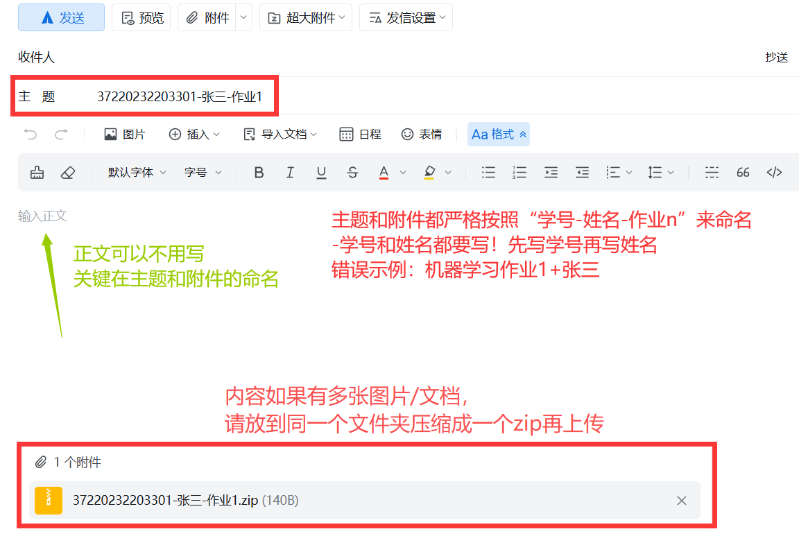

<!--
第五周 作业4
-->
# 第五周 作业4

DDL：10月14日 

提交格式：学号-姓名-作业n

<!--
提交邮箱：994944128@qq.com
-->
提交邮箱：[994944128@qq.com](mailto:994944128@qq.com)

<!--
作业 4.pdf
-->
![[Assets/作业 4.pdf]]

126.88 KB

<!--

-->

---

## Redefine the symbols
$$\begin{align}
\mathbf{D} = (\mathbf{X},\overrightarrow{y}),\ \mathbf{X} & \in {\{0,1\}}^{n \times d}, \ \overrightarrow{y} \in {\{0,1\}}^{n} \\
P{(Y = y_i)} & = {p_y}^{y_i} (1 - p_y)^{1 - y_i}, p_y \in (0,1), \ i \in [1,n] \\
P{(X_j = x_{i,j} | Y_j = 0)} & = {u_{0,j}}^{x_{i,j}} (1 - {u_{0,j}})^{1 - x_{i,j}}, \ i \in [1,n], j \in [1,d] \\
P{(X_j = x_{i,j} | Y_j = 1)} & = {u_{1,j}}^{x_{i,j}} (1 - {u_{1,j}})^{1 - x_{i,j}}, \ i \in [1,n], j \in [1,d] \\
\overrightarrow{u_0} = (u_{0,1},u_{0,2},u_{0,3},\cdots,u_{0,d})^T, \ \overrightarrow{u_1} & = (u_{1,1},u_{1,2},u_{1,3},\cdots,u_{1,d})^T, \ \overrightarrow{\theta} = (p_y,\overrightarrow{u_0}^T,\overrightarrow{u_1}^T) \\
L_{\mathbf{D}}{(\overrightarrow{\theta})} & = -\ln{(P{(Z = \mathbf{D} ; \overrightarrow{\theta})})} \\
& = -\ln{\prod_{i = 1}^{n}{\prod_{j = 1}^{d}{P{(X_j = x_{i,j},Y = y_i ; \overrightarrow{\theta})}}}},\ (\text{assume that } x_{i,j} \text{ are independent of } x_{i*,y*} \text{ and } y_i \text{ are independent of } y_{i*}) \\
& = -\ln{\prod_{i = 1}^{n}{\prod_{j = 1}^{d}{(P{(X_j = x_{i,j} | Y = y_i ; \overrightarrow{\theta})} P{(Y = y_i ; \overrightarrow{\theta})})}}} \\
& = -\sum_{i = 1}^{n}{\sum_{j = 1}^{d}{\ln{(P{(X_j = x_{i,j} | Y = y_i ; \overrightarrow{\theta})} P{(Y = y_i ; \overrightarrow{\theta})})}}} \\
n_1 = \sum_{i = 1}^{n}{y_i}, & \ n_0 = \sum_{i = 1}^{n}{(1 - y_i)} \\
\prescript{}{0}{m_{0,j}} = \sum_{i = 1}^{n}{\mathbb{I}{((x_{i,j} = 0) \land (y_j = 0))}}, & \ \prescript{}{1}{m_{0,j}} = \sum_{i = 1}^{n}{\mathbb{I}{((x_{i,j} = 1) \land (y_j = 0))}}, \ \prescript{}{0}{m_{1,j}} = \sum_{i = 1}^{n}{\mathbb{I}{((x_{i,j} = 0) \land (y_j = 1))}}, \ \prescript{}{1}{m_{1,j}} = \sum_{i = 1}^{n}{\mathbb{I}{((x_{i,j} = 1) \land (y_j = 1))}} \\
\end{align}$$

## Answer
$$\begin{align}
L_{\mathbf{D}}{(\overrightarrow{\theta})} & = -\sum_{i = 1}^{n}{\sum_{j = 1}^{d}{\ln{(P{(X_j = x_{i,j} | Y = y_i ; \overrightarrow{\theta})} P{(Y = y_i ; \overrightarrow{\theta})})}}} \\
& = -\sum_{i = 1}^{n}{\sum_{j = 1}^{d}{\ln{P{(X_j = x_{i,j} | Y = y_i ; \overrightarrow{\theta})}}}} - d \sum_{i = 1}^{n}{\ln{P{(Y = y_i ; \overrightarrow{\theta})}}} \\
& = -\sum_{i = 1}^{n}{\mathbb{I}{(y_i = 1)} \sum_{j = 1}^{d}{\ln{({u_{1,j}}^{x_{i,j}} {(1 -u_{1,j})}^{(1 - x_{i,j})})}}} - \sum_{i = 1}^{n}{\mathbb{I}{(y_i = 0)} \sum_{j = 1}^{d}{\ln{({u_{0,j}}^{x_{i,j}} {(1 - u_{0,j})}^{(1 - x_{i,j})})}}} - d \sum_{i = 1}^{n}{\ln{{p_y}^{y_i} {(1 - p_y)}^{(1 - y_i)}}} \\
& = -\sum_{i = 1}^{n}{\mathbb{I}{(y_i = 1)} \sum_{j = 1}^{d}{(x_{i,j} \ln{u_{1,j}} + (1 - x_{i,j}) \ln{(1 -u_{1,j})})}} - \sum_{i = 1}^{n}{\mathbb{I}{(y_i = 0)} \sum_{j = 1}^{d}{(x_{i,j} \ln{u_{0,j}} + (1 - x_{i,j}) \ln{(1 -u_{0,j})})}} - d \sum_{i = 1}^{n}{({y_i} \ln{p_y} + (1 - y_i) \ln{(1 - p_y)})} \\
& = -\sum_{j = 1}^{d}{(\prescript{}{1}{m_{1,j}} \ln{u_{1,j}} + \prescript{}{0}{m_{1,j}} \ln{(1 - u_{1,j})} + \prescript{}{1}{m_{0,j}} \ln{u_{0,j}} + \prescript{}{0}{m_{0,j}} \ln{(1 - u_{0,j})})} - d (n_1 \ln{p_y} + n_0 \ln{(1 - p_y)}) \\
\therefore \nabla{L_{\mathbf{D}}} & = (\frac{n_0}{1 - p_y} - \frac{n_1}{p_y},(\frac{\prescript{}{0}{m_{0,i}}}{1 - u_{0,i}} - \frac{\prescript{}{1}{m_{0,i}}}{u_{0,i}})_{i = 1}^{d}, (\frac{\prescript{}{0}{m_{1,i}}}{1 - u_{1,i}} - \frac{\prescript{}{1}{m_{1,i}}}{u_{1,i}})_{i = 1}^{d})^T \\
\nabla^2{L_{\mathbf{D}}} & = \operatorname{Diag}{(\frac{n_0}{(1 - p_y)^2} + \frac{n_1}{{p_y}^2},(\frac{\prescript{}{0}{m_{0,i}}}{(1 - u_{0,i})^2} + \frac{\prescript{}{1}{m_{0,i}}}{{u_{0,i}}^2})_{i = 1}^{d},(\frac{\prescript{}{0}{m_{1,i}}}{(1 - u_{1,i})^2} + \frac{\prescript{}{1}{m_{1,i}}}{{u_{1,i}}^2})_{i = 1}^{d})} \succ \mathbf{0} \\
\therefore \arg{(\nabla{L_{\mathbf{D}}} = 0)} & = \arg{\min{L_{\mathbf{D}}}} \\
p_y = \frac{n_1}{n_0 + n_1}, \ (u_{0,i} & = \frac{\prescript{}{1}{m_{0,i}}}{\prescript{}{0}{m_{0,i}} + \prescript{}{1}{m_{0,i}}})_{i = 1}^{d}, \ (u_{1,i} = \frac{\prescript{}{1}{m_{1,i}}}{\prescript{}{0}{m_{1,i}} + \prescript{}{1}{m_{1,i}}})_{i = 1}^{d} \\
\end{align}$$
