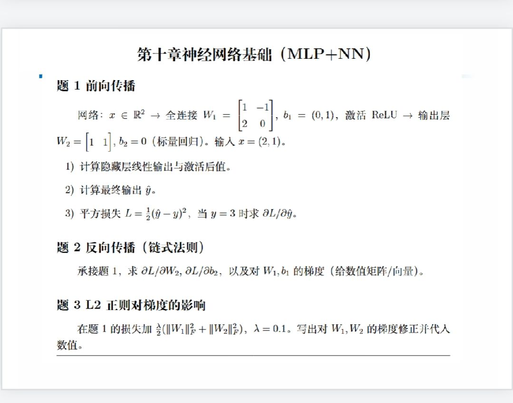

<!--
11月11日机器学习作业
-->
# 11月11日机器学习作业

<!--

-->

<!--
以上是本周机器学习课的作业6，截至时间11月17日晚，提交至邮箱994944128@qq.com。
-->
以上是本周机器学习课的作业6，截至时间11月17日晚，提交至邮箱[994944128@qq.com](mailto:994944128@qq.com)。

以【添加附件】的形式发送，不要把内容写在邮件的正文部分。

作业按照＂学号-姓名-作业n＂格式命名。

如＂3722022345678–张三–作业1＂。

---

# 1
## 1)
$$\begin{align}
y_1 & = W_1 x + b_1 \\
& = \begin{pmatrix}1 & -1 \\ 2 & 0\end{pmatrix} \begin{pmatrix}2 \\ 1\end{pmatrix} + \begin{pmatrix}0 \\ 1\end{pmatrix} \\
& = \begin{pmatrix}1 \\ 5\end{pmatrix} \\
f(y_1) & = \operatorname{ReLU}{(y_1)} \\
& = \begin{pmatrix}1 \\ 5\end{pmatrix} \\
\end{align}$$

## 2)
$$\begin{align}
\hat{y} & = f(W_2 f(y_1) + b_2) \\
\therefore & = \operatorname{ReLU}{(\begin{pmatrix}1 & 1\end{pmatrix} \begin{pmatrix}1 \\ 5\end{pmatrix} + 0)} \\
& = 6 \\
\end{align}$$

## 3)
$$\begin{align}
\partial{L}/\partial{\hat{y}} & = \frac{\mathrm{d}{(\frac{1}{2} (\hat{y} - y)^2)}}{\mathrm{d}{\hat{y}}} \\
& = \hat{y} - y \\
\therefore & = 6 - 3 \\
& = 3 \\
\end{align}$$

# 2
$$\begin{align}
\partial{L}/\partial{W_2} & = \begin{pmatrix}\frac{\partial{L}}{\partial{\prescript{1}{1}{W_2}}} \\ \frac{\partial{L}}{\partial{\prescript{1}{2}{W_2}}} \end{pmatrix}\\
& = \frac{\mathrm{d}{L}}{\mathrm{d}{\hat{y}}} \begin{pmatrix}\frac{\partial{\hat{y}}}{\partial{\prescript{1}{1}{W_2}}} \\ \frac{\partial{\hat{y}}}{\partial{\prescript{1}{2}{W_2}}}\end{pmatrix} \\
\therefore & = 3 \left. \begin{pmatrix}\frac{\partial{\operatorname{ReLU}{(\begin{pmatrix}\prescript{1}{1}{W_2} & \prescript{1}{2}{W_2}\end{pmatrix} \begin{pmatrix}1 \\ 5\end{pmatrix} + b_2)}}}{\partial{\prescript{1}{1}{W_2}}} \\ \frac{\partial{\operatorname{ReLU}{(\begin{pmatrix}\prescript{1}{1}{W_2} & \prescript{1}{2}{W_2}\end{pmatrix} \begin{pmatrix}1 \\ 5\end{pmatrix} + b_2)}}}{\partial{\prescript{1}{2}{W_2}}}\end{pmatrix} \right|_{W_2 = \begin{pmatrix}1 & 1\end{pmatrix}, b_2 = 0} \\
& = 3 \begin{pmatrix}1 \\ 5\end{pmatrix} \\
& = \begin{pmatrix}3 \\ 15\end{pmatrix} \\
\partial{L}/\partial{b_2} & = \frac{\mathrm{d}{L}}{\mathrm{d}{\hat{y}}} \frac{\partial{\hat{y}}}{\partial{b_2}} \\
\therefore & = 3 \left. \frac{\partial{\operatorname{ReLU}{(\begin{pmatrix}\prescript{1}{1}{W_2} & \prescript{1}{2}{W_2}\end{pmatrix} \begin{pmatrix}1 \\ 5\end{pmatrix} + b_2)}}}{\partial{b_2}} \right|_{W_2 = \begin{pmatrix}1 & 1\end{pmatrix}, b_2 = 0} \\
& = 3 \times 1 \\
& = 3 \\
\frac{\partial{L}}{\partial{\prescript{i}{j}{W_1}}} & = \frac{\mathrm{d}{L}}{\mathrm{d}{\hat{y}}} \frac{\partial{\hat{y}}}{\partial{\prescript{i}{j}{W_1}}}, \ (i, j = \{1,2\}) \\
& = \frac{\mathrm{d}{L}}{\mathrm{d}{\hat{y}}} (\frac{\partial{\hat{y}}}{\partial{f(y_1)_1}} \frac{\partial{f(y_1)_1}}{\partial{\prescript{i}{j}{W_1}}} + \frac{\partial{\hat{y}}}{\partial{f(y_1)_2}} \frac{\partial{f(y_1)_2}}{\partial{\prescript{i}{j}{W_1}}}) \\
\therefore & = 3 (\left. \frac{\partial{\operatorname{ReLU}{(\begin{pmatrix}1 & 1\end{pmatrix} \begin{pmatrix}f(y_1)_1 \\ f(y_1)_2\end{pmatrix} + 0)}}}{\partial{f(y_1)_1}} \right|_{W_1 = \begin{pmatrix}1 & -1 \\ 2 & 0\end{pmatrix}, b_1 = \begin{pmatrix}0 \\ 1\end{pmatrix}} \frac{\partial{f(y_1)_1}}{\partial{\prescript{i}{j}{W_1}}} + \left. \frac{\partial{\operatorname{ReLU}{(\begin{pmatrix}1 & 1\end{pmatrix} \begin{pmatrix}f(y_1)_1 \\ f(y_1)_2\end{pmatrix} + 0)}}}{\partial{f(y_1)_2}} \right|_{W_1 = \begin{pmatrix}1 & -1 \\ 2 & 0\end{pmatrix}, b_1 = \begin{pmatrix}0 \\ 1\end{pmatrix}} \frac{\partial{f(y_1)_2}}{\partial{\prescript{i}{j}{W_1}}}) \\
& = 3 (\left. \frac{\partial{{\operatorname{ReLU}{(W_1 \begin{pmatrix}2 \\ 1\end{pmatrix} + b_1)}}_1}}{\partial{\prescript{i}{j}{W_1}}} \right|_{W_1 = \begin{pmatrix}1 & -1 \\ 2 & 0\end{pmatrix}, b_1 = \begin{pmatrix}0 \\ 1\end{pmatrix}} + \left. \frac{\partial{{\operatorname{ReLU}{(W_1 \begin{pmatrix}2 \\ 1\end{pmatrix} + b_1)}}_2}}{\partial{\prescript{i}{j}{W_1}}} \right|_{W_1 = \begin{pmatrix}1 & -1 \\ 2 & 0\end{pmatrix}, b_1 = \begin{pmatrix}0 \\ 1\end{pmatrix}}) \\
& = 3 x_j \\
\therefore \frac{\partial{L}}{\partial{\prescript{1}{1}{W_1}}} & = 3 \times 2 \\
& = 6 \\
\therefore \frac{\partial{L}}{\partial{\prescript{1}{2}{W_1}}} & = 3 \times 1 \\
& = 3 \\
\therefore \frac{\partial{L}}{\partial{\prescript{2}{1}{W_1}}} & = 3 \times 2 \\
& = 6 \\
\therefore \frac{\partial{L}}{\partial{\prescript{2}{2}{W_1}}} & = 3 \times 1 \\
& = 3 \\
\frac{\partial{L}}{\partial{\prescript{}{i}{b_1}}} & = \frac{\mathrm{d}{L}}{\mathrm{d}{\hat{y}}} \frac{\partial{\hat{y}}}{\partial{\prescript{i}{j}{W_1}}}, \ (i = \{1,2\}) \\
& = \frac{\mathrm{d}{L}}{\mathrm{d}{\hat{y}}} (\frac{\partial{\hat{y}}}{\partial{f(y_1)_1}} \frac{\partial{f(y_1)_1}}{\partial{\prescript{}{i}{b_1}}} + \frac{\partial{\hat{y}}}{\partial{f(y_1)_2}} \frac{\partial{f(y_1)_2}}{\partial{\prescript{}{i}{b_1}}}) \\
\therefore & = 3 (\left. \frac{\partial{\operatorname{ReLU}{(\begin{pmatrix}1 & 1\end{pmatrix} \begin{pmatrix}f(y_1)_1 \\ f(y_1)_2\end{pmatrix} + 0)}}}{\partial{f(y_1)_1}} \right|_{W_1 = \begin{pmatrix}1 & -1 \\ 2 & 0\end{pmatrix}, b_1 = \begin{pmatrix}0 \\ 1\end{pmatrix}} \frac{\partial{f(y_1)_1}}{\partial{\prescript{}{i}{b_1}}} + \left. \frac{\partial{\operatorname{ReLU}{(\begin{pmatrix}1 & 1\end{pmatrix} \begin{pmatrix}f(y_1)_1 \\ f(y_1)_2\end{pmatrix} + 0)}}}{\partial{f(y_1)_2}} \right|_{W_1 = \begin{pmatrix}1 & -1 \\ 2 & 0\end{pmatrix}, b_1 = \begin{pmatrix}0 \\ 1\end{pmatrix}} \frac{\partial{f(y_1)_2}}{\partial{\prescript{}{i}{b_1}}}) \\
& = 3 (\left. \frac{\partial{{\operatorname{ReLU}{(W_1 \begin{pmatrix}2 \\ 1\end{pmatrix} + b_1)}}_1}}{\partial{\prescript{}{i}{b_1}}} \right|_{W_1 = \begin{pmatrix}1 & -1 \\ 2 & 0\end{pmatrix}, b_1 = \begin{pmatrix}0 \\ 1\end{pmatrix}} + \left. \frac{\partial{{\operatorname{ReLU}{(W_1 \begin{pmatrix}2 \\ 1\end{pmatrix} + b_1)}}_2}}{\partial{\prescript{}{i}{b_1}}} \right|_{W_1 = \begin{pmatrix}1 & -1 \\ 2 & 0\end{pmatrix}, b_1 = \begin{pmatrix}0 \\ 1\end{pmatrix}}) \\
& = 3 \times 1 \\
& = 3 \\
\end{align}$$

# 3
$$\begin{align}
L' & = L + \frac{\lambda}{2} (\|W_1\|^2_F + \|W_2\|^2_F) \\
\frac{\partial{L'}}{\partial{\prescript{i}{j}{W_k}}} & = \frac{\partial{L}}{\partial{\prescript{i}{j}{W_k}}} + \lambda \prescript{i}{j}{W_k}, \ (i, j, k = \{1, 2\}) \land (k = 2 \rightarrow i = 1) \\
\therefore \frac{\partial{L'}}{\partial{\prescript{1}{1}{W_1}}} & = 6 + 0.1 \times 1 \\
& = 6.1 \\
\therefore \frac{\partial{L'}}{\partial{\prescript{1}{2}{W_1}}} & = 3 + 0.1 \times (-1) \\
& = 2.9 \\
\therefore \frac{\partial{L'}}{\partial{\prescript{1}{1}{W_1}}} & = 6 + 0.1 \times 2 \\
& = 6.2 \\
\therefore \frac{\partial{L'}}{\partial{\prescript{1}{2}{W_1}}} & = 3 + 0.1 \times 0 \\
& = 3 \\
\therefore \frac{\partial{L'}}{\partial{\prescript{1}{1}{W_2}}} & = 3 + 0.1 \times 1 \\
& = 3.1 \\
\therefore \frac{\partial{L'}}{\partial{\prescript{1}{2}{W_2}}} & = 15 + 0.1 \times 1 \\
& = 15.1 \\
\end{align}$$
