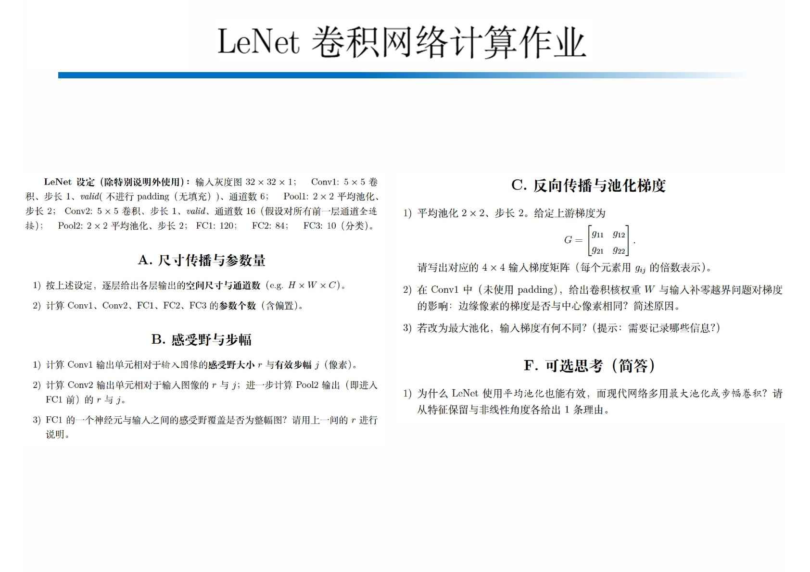

---

# A.
## 1)
- Conv1: $(32 - 5 + 1) \times (32 - 5 + 1) \times 6 = 28 \times 28 \times 6$
- Pool1: $(\frac{28 - 2}{2} + 1) \times (\frac{28 - 2}{2} + 1) \times 6 = 14 \times 14 \times 6$
- Conv2: $(14 - 5 + 1) \times (14 - 5 + 1) \times 16 = 10 \times 10 \times 16$
- Pool2: $(\frac{10 - 2}{2} + 1) \times (\frac{10 - 2}{2} + 1) \times 16 = 5 \times 5 \times 16$

## 2)
- Conv1: $5 \times 5 \times 1 \times 6 + 6= 156$
- Conv2: $5 \times 5 \times 6 \times 16 + 16 = 2416$
- FC1: $5 \times 5 \times 16 \times 120 + 120 = 48120$
- FC2: $120 \times 84 + 84 = 10164$
- FC3: $84 \times 10 + 10 = 850$

# B.
## 1)
$r = 5 \times 5, \ j = 1$

## 2)
- Conv2: $r' = (5 + 1) \times (5 + 1) = 6 \times 6, \ j' = 2 \times 1 = 2$; $\therefore r = (6 + 2 \times (5 - 1)) \times (6 + 2 \times (5 - 1)) = 14 \times 14, \ j = 1 \times 2 = 2$
- Pool2: $(14 + 2) \times (14 + 2) = 16 \times 16, j = 2 \times 2 = 4$

## 3)
No.
$r = 16 \times 16 < 32 \times 32$

# C.
## 1)
$$\begin{align}
\begin{pmatrix}\frac{1}{4} g_{11} & \frac{1}{4} g_{11} & \frac{1}{4} g_{12} & \frac{1}{4} g_{12} & \\ \frac{1}{4} g_{11} & \frac{1}{4} g_{11} & \frac{1}{4} g_{12} & \frac{1}{4} g_{12} & \\ \frac{1}{4} g_{21} & \frac{1}{4} g_{21} & \frac{1}{4} g_{22} & \frac{1}{4} g_{22} & \\ \frac{1}{4} g_{21} & \frac{1}{4} g_{21} & \frac{1}{4} g_{22} & \frac{1}{4} g_{22} & \\ \end{pmatrix}
\end{align}$$

## 2)
No. Because center pixels are included in more cores than edge pixels.

## 3)
Which pixel in the core is preserved.
