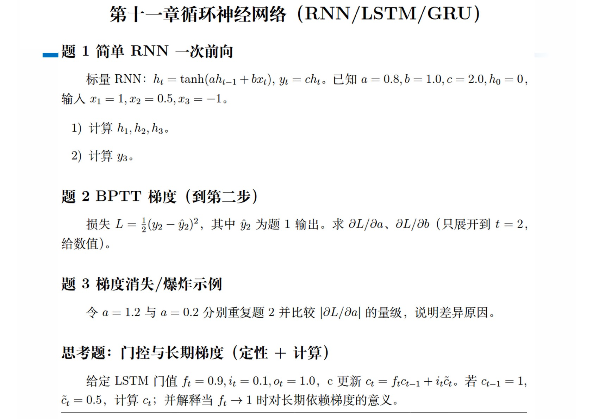

---

# 1
## 1)
$$\begin{align}
h_t & = \tanh{(a h_{t - 1} + b x_t)} \\
h_1 & = \tanh{(0.8 \times 0 + 1.0 \times 1)} \\
& = \tanh{1} \approx 0.76 \\
h_2 & = \tanh{(0.8 \times \tanh{1} + 1.0 \times 0.5)} \\
& = \tanh{(0.8 \tanh{1} + 0.5)} \approx 0.80 \\
h_3 & = \tanh{(0.8 \times \tanh{(0.8 \tanh{1} + 0.5)} + 1.0 \times (-1))} \\
& = \tanh{(0.8 \tanh{(0.8 \tanh{1} + 0.5)} - 1)} \approx -0.47 \\
\end{align}$$

## 2)
$$\begin{align}
y_t & = c h_t \\
y_3 & = 2.0 \times \tanh{(0.8 \tanh{(0.8 \tanh{1} + 0.5)} - 1)} \\
& = 2.0 \tanh{(0.8 \tanh{(0.8 \tanh{1} + 0.5)} - 1)} \\
& \approx -0.93 \\
\end{align}$$

# 2
$$\begin{align}
\mathrm{d}{L} & = y_2 - \mathrm{d}{\hat{y_2}} \\
& = y_2 - c \mathrm{d}{h_2} \\
& = y_2 - c \mathrm{d}{\tanh{(a h_1 + b x_2)}} \\
& = y_2 - c (1 - {h_2}^2) (h_1 \mathrm{d}{a} + a \mathrm{d}{h_1} + x_2 \mathrm{d}{b}) \\
& = y_2 - c (1 - {h_2}^2) (h_1 \mathrm{d}{a} + a \mathrm{d}{\tanh{(a h_0 + b x_1)}} + x_2 \mathrm{d}{b}) \\
& = y_2 - c (1 - {h_2}^2) (h_1 \mathrm{d}{a} + a (1 - {h_1}^2) (h_0 \mathrm{d}{a} + x_1 \mathrm{d}{b}) + x_2 \mathrm{d}{b}) \\
\therefore \partial{L}/\partial{a} & = - c (1 - {h_2}^2) (h_1 + a h_0 (1 - {h_1}^2)) \\
\partial{L}/\partial{b} & = - c (1 - {h_2}^2) (x_2 + a x_1 (1 - {h_1}^2)) \\
\therefore \partial{L}/\partial{a} & = - 2.0 (1 - \tanh^2{(0.8 \tanh{1} + 0.5)}) (\tanh{1} + 0.8 \times 0 \times (1 - \tanh^2{1})) \\
& = - 2 \tanh{1} (1 - \tanh^2{(0.8 \tanh{1} + 0.5)}) \\
& \approx -0.54 \\
\therefore \partial{L}/\partial{b} & = - 2.0 (1 - \tanh^2{(0.8 \tanh{1} + 0.5)}) (0.5 + 0.8 \times 1 \times (1 - \tanh^2{1})) \\
& = - 2 (1 - \tanh^2{(0.8 \tanh{1} + 0.5)}) (0.5 + 0.8 (1 - \tanh^2{1})) \\
& \approx -0.59 \\
\end{align}$$

# 3
- $a = 1.2$
- $a = 0.2$

# 
$$\begin{align}
c_t & = f_t c_{t - 1} + i_t \widetilde{c_{t}} \\
& = 0.9 \times 1 + 0.1 \times 0.5 \\
& = 0.95 \\
\\
f_t & \to 1, \ c_t \to c_{t - 1} + i_t \widetilde{c_{t}}, \ \text{increase the long term effect.} \\
\end{align}$$
