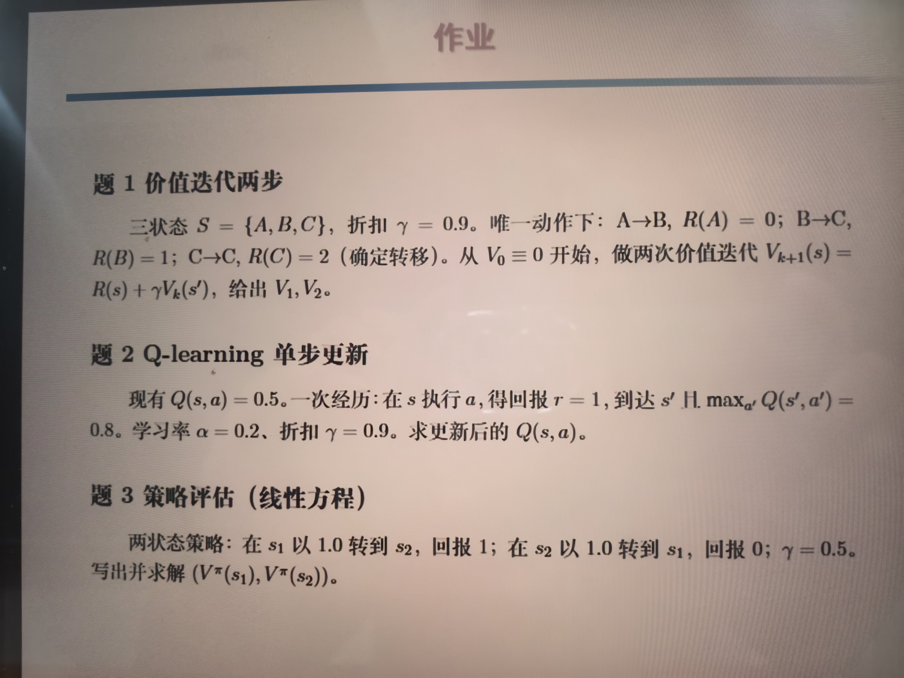

---

# 1
- $\operatorname{V_1}{(s)} = R(s) + 0.9 \times 0 = R(s)$:
	$$\begin{align}
	\operatorname{V_1}{(A)} & = R(A) = 0 \\
	\operatorname{V_1}{(B)} & = R(B) = 1 \\
	\operatorname{V_1}{(C)} & = R(C) = 2 \\
	\end{align}$$
- $\operatorname{V_2}{(s)} = R(S) + 0.9 \times \operatorname{V_1}{(s')}$
	$$\begin{align}
	\operatorname{V_2}{(A)} & = R(A) + 0.9 \operatorname{V_1}{(B)} = 0 + 0.9 \times 1 = 0.9 \\
	\operatorname{V_2}{(B)} & = R(B) + 0.9 \operatorname{V_1}{(C)} = 1 + 0.9 \times 2 = 2.8 \\
	\operatorname{V_2}{(C)} & = R(C) + 0.9 \operatorname{V_1}{(C)} = 2 + 0.9 \times 2 = 3.8 \\
	\end{align}$$

# 2
$$\begin{align}
Q(s,a) & \longleftarrow Q(s,a) + \alpha (r + \gamma \max_{a'}{Q(s',a')} - Q(s,a)) \\
& = 0.5 + 0.2 \times (1 + 0.9 \times 0.8 - 0.5) \\
& = 0.744 \\
\end{align}$$

# 3
$$\begin{align}
&
\begin{cases}
\operatorname{V^{\pi}}{(s_1)} & = p_{s_1 \to s_2} (R(s_1 \to s_2) + \gamma \operatorname{V^{\pi}}{(s_2)}) \\
\operatorname{V^{\pi}}{(s_2)} & = p_{s_2 \to s_1} (R(s_2 \to s_1) + \gamma \operatorname{V^{\pi}}{(s_1)}) \\
\end{cases}
\\
&
\begin{cases}
\operatorname{V^{\pi}}{(s_1)} & = 1 + 0.5 \operatorname{V^{\pi}}{(s_2)} \\
\operatorname{V^{\pi}}{(s_2)} & = 0 + 0.5 \operatorname{V^{\pi}}{(s_1)} \\
\end{cases}
\\
&
\begin{cases}
\operatorname{V^{\pi}}{(s_1)} & = 1 + 0.5 \operatorname{V^{\pi}}{(s_2)} \\
\operatorname{V^{\pi}}{(s_2)} & = 0.5 \operatorname{V^{\pi}}{(s_1)} \\
\end{cases}
\\
\therefore & \operatorname{V^{\pi}}{(s_1)} = 1 + 0.5 \times 0.5 \operatorname{V^{\pi}}{(s_1)} \\
\therefore
&
\begin{cases}
\operatorname{V^{\pi}}{(s_1)} & = \frac{4}{3} \\
\operatorname{V^{\pi}}{(s_2)} & = \frac{2}{3} \\
\end{cases}
\\
\end{align}$$
